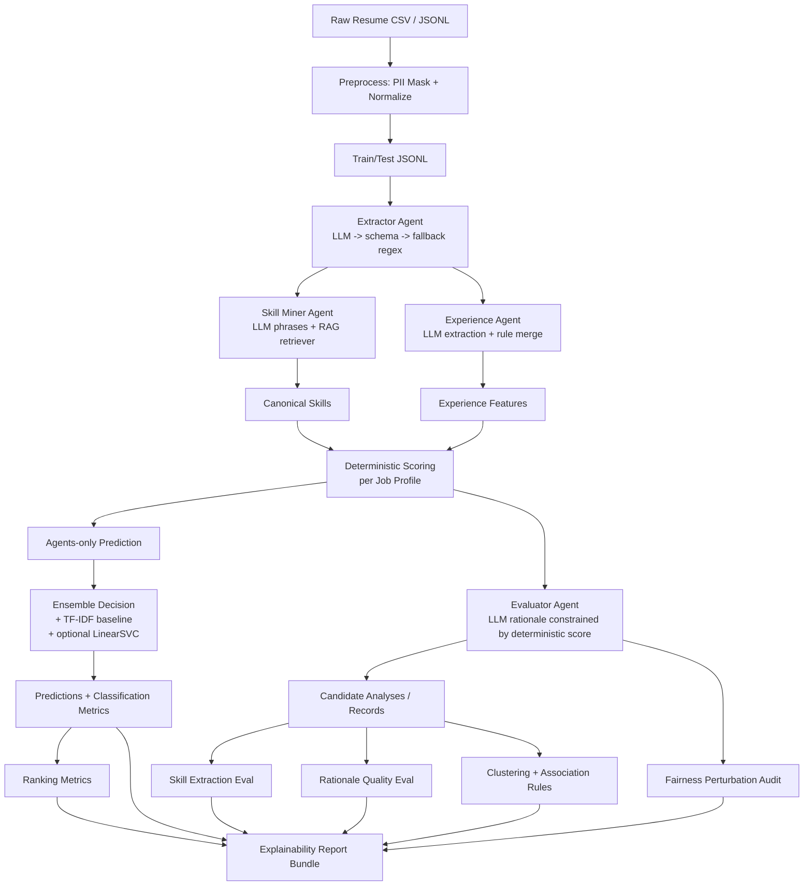

# Multi-Agent Resume Screening and Skill Mining

A production-style, research-oriented pipeline for resume screening that combines:

- A four-agent analysis stack (Extractor, Skill Miner, Experience, Evaluator)
- RAG-based skill normalization over a curated ontology
- Deterministic, explainable candidate-fit scoring
- Optional LLM-authored rationales with strict schema validation + fallback
- Fairness perturbation auditing
- Downstream mining (clustering + association rules)

The repository is designed to run even when no LLM backend is available: each agent degrades to deterministic logic so experiments stay reproducible.

## Table of Contents

1. [What This Repo Does](#what-this-repo-does)
2. [Pipeline Diagram](#pipeline-diagram)
3. [Latest Results](#latest-results)
4. [Repository Structure](#repository-structure)
5. [Core Components](#core-components)
6. [Environment and Dependencies](#environment-and-dependencies)
7. [Data Preparation](#data-preparation)
8. [How to Run](#how-to-run)
9. [Outputs and Artifacts](#outputs-and-artifacts)
10. [Evaluation Protocols](#evaluation-protocols)
11. [LLM Backends and Caching](#llm-backends-and-caching)
12. [Testing](#testing)
13. [Troubleshooting](#troubleshooting)
14. [Notes on Reproducibility](#notes-on-reproducibility)

## What This Repo Does

Given resume text and occupational categories, the system:

- Extracts structured resume sections and raw skills
- Mines and canonicalizes skills using embedding retrieval
- Computes experience signals (years, leadership, impact)
- Scores candidate-role fit using deterministic component scores
- Produces classification predictions in two modes:
  - `agents_only`: pure multi-agent deterministic scoring argmax
  - `ensemble`: combines agents + TF-IDF baseline + supervised classifier
- Audits fairness via text perturbations
- Computes ranking and skill-extraction metrics
- Generates explainability bundles and optional downstream mining outputs

## Pipeline Diagram



## Latest Results

From latest reported run:

- Ensemble: `68.4%` accuracy, `0.6368` macro-F1
- Baseline (TF-IDF + Logistic Regression): `63.9%` accuracy, `0.6115` macro-F1
- Agents-only: approximately `23%` accuracy (reported as low-performing standalone path)
- Skill extraction: high precision (`~0.70`) and low recall (`~0.22`)
- Fairness: small but measurable perturbation-based score shifts

Interpretation in the presentation:

- Hybrid ensemble outperforms baseline on classification
- Multi-agent layer improves explainability and structure
- Ranking/recall are still constrained by profile quality

## Repository Structure

```text
src/
  agents/            # Extractor, Skill Miner, Experience, Evaluator agents
  app/               # End-to-end pipeline + report generator
  data/              # Data loading, preprocessing, PII masking, annotations builder
  eval/              # Classification, ranking, skill extraction, rationale quality evaluation
  fairness/          # Perturbations and fairness metrics
  llm/               # Provider adapter, prompts, JSON schemas
  mining/            # Clustering and association-rule mining
  models/            # Deterministic scorer, TF-IDF baseline, supervised classifier
  rag/               # Ontology, embeddings, vector store, retriever
  shared.py          # Shared dataclasses for all pipeline artifacts

scripts/             # Diagnostics, ablations, and result inspection utilities
data/                # Raw + processed datasets + cached resources
artifacts/           # Generated outputs from baseline, evaluations, and pipeline runs
tests/               # Unit tests for core evaluation behavior
```

## Core Components

- `src/eval/evaluation_runner.py`
Runs the main multi-agent evaluation and writes both `ensemble` and `agents_only` artifacts.

- `src/app/pipeline.py`
Milestone-4 driver that chains evaluation + clustering + association rules + report generation.

- `src/models/scoring.py`
Defines job profiles and deterministic fit scoring. This keeps scoring reproducible and auditable.

- `src/llm/provider.py`
Auto-selects LLM backend (`gemini` -> `openai_compatible` -> `ollama` -> rule-based fallback), with SQLite response caching.

- `src/rag/*`
Ontology + embedding-based retrieval for mapping messy skill phrases to canonical skills.

## Environment and Dependencies

### Python

- Recommended: Python `3.10+`

### Install

```bash
python -m venv .venv
# Windows PowerShell:
.\.venv\Scripts\Activate.ps1

pip install --upgrade pip
pip install -r requirements.txt
```

## Data Preparation

If using the included Kaggle-style CSV (`data/Main DataSet Resume.csv`):

```bash
python -m src.data.preprocess \
  --input_csv "data/Main DataSet Resume.csv" \
  --output_dir data/processed_main \
  --text_col Resume_str \
  --label_col Category
```

This creates:

- `data/processed_main/train.jsonl`
- `data/processed_main/test.jsonl`

## How to Run

### 1. Baseline (TF-IDF)

```bash
python -m src.models.baseline_tfidf \
  --train_jsonl data/processed_main/train.jsonl \
  --test_jsonl data/processed_main/test.jsonl \
  --output_dir artifacts/main_baseline
```

### 2. Build skill-extraction gold annotations (optional but recommended)

```bash
python -m src.data.build_skill_annotations \
  --source_jsonl data/processed_main/test.jsonl \
  --output data/annotations/skills_gold.jsonl
```

### 3. Multi-agent evaluation (ensemble + agents-only)

```bash
python -m src.eval.evaluation_runner \
  --train_jsonl data/processed_main/train.jsonl \
  --test_jsonl data/processed_main/test.jsonl \
  --output_dir artifacts/main_multi_agent \
  --baseline_predictions artifacts/main_baseline/baseline_predictions.csv \
  --skill_gold data/annotations/skills_gold.jsonl
```

### 4. Agents-only ablation run

```bash
python -m src.eval.evaluation_runner \
  --disable_supervised \
  --test_jsonl data/processed_main/test.jsonl \
  --output_dir artifacts/main_multi_agent_agents_only \
  --baseline_predictions artifacts/main_baseline/baseline_predictions.csv \
  --skill_gold data/annotations/skills_gold.jsonl
```

### 5. Full pipeline (evaluation + mining + report bundle)

```bash
python -m src.app.pipeline \
  --train_jsonl data/processed_main/train.jsonl \
  --test_jsonl data/processed_main/test.jsonl \
  --output_dir artifacts/main_pipeline \
  --baseline_predictions artifacts/main_baseline/baseline_predictions.csv \
  --skill_gold data/annotations/skills_gold.jsonl
```

## Outputs and Artifacts

Common outputs from `src.eval.evaluation_runner` include:

- `multi_agent_predictions.csv`
- `multi_agent_predictions_agents_only.csv`
- `multi_agent_metrics.json`
- `multi_agent_metrics_agents_only.json`
- `multi_agent_records.jsonl`
- `ranking_metrics.json`
- `skill_extraction_metrics.json`
- `rationale_quality.json`
- `rationale_quality_audits.jsonl`

Additional outputs from `src.app.pipeline` include:

- `pipeline_predictions.csv`
- `cluster_assignments.csv` (if clustering succeeds)
- `association_rules.csv` (if rules are mined)
- `explainability_report.md`
- `explainability_report.json`
- `pipeline_summary.json`

## Evaluation Protocols

- Classification metrics: accuracy, macro/weighted precision/recall/F1
- Ranking metrics: Precision@k, Recall@k, MAP@k, nDCG@k
- Skill extraction: canonical-level precision/recall/F1 against gold labels
- Rationale quality: grounding, specificity, calibration, identity cleanliness
- Fairness: perturbation-based score and selection-rate deltas with intervals

## LLM Backends and Caching

`src/llm/provider.py` supports:

- `gemini`
- `openai_compatible` (LM Studio / vLLM / llama.cpp-style APIs)
- `ollama`
- `rule_based` fallback

Relevant environment variables:

- `LLM_BACKEND` (`auto` by default)
- `GEMINI_API_KEY` / `GOOGLE_API_KEY`
- `OPENAI_BASE_URL`, `OPENAI_MODEL`, `OPENAI_API_KEY`
- `OLLAMA_HOST`, `OLLAMA_MODEL`
- `LLM_TEMPERATURE`, `LLM_MAX_OUTPUT_TOKENS`, `LLM_TIMEOUT_SECONDS`
- `LLM_ENABLE_CACHE`, `LLM_CACHE_PATH`

Cache default path:

- `data/llm_cache.sqlite`

## Testing

Run all tests:

```bash
pytest -q
```

Current tests focus on:

- Rationale quality evaluation behavior
- V3 component-level expectations

## Troubleshooting

- If no LLM is available, the system should still run via deterministic fallbacks.
- If embedding model download fails, embedding backend can fall back to TF-IDF behavior.
- If prediction quality looks unexpectedly high/low, verify whether `ensemble` or `agents_only` is being compared.
- Check provider info in metrics JSON (`providers`) to confirm which backend was actually used.

## Notes on Reproducibility

- Deterministic scoring is intentionally preserved even when LLMs are used for narrative fields.
- Every LLM completion is cache-keyed by backend/model/prompt/schema.
- Report both `baseline`, `agents_only`, and `ensemble` to keep model contribution transparent.
